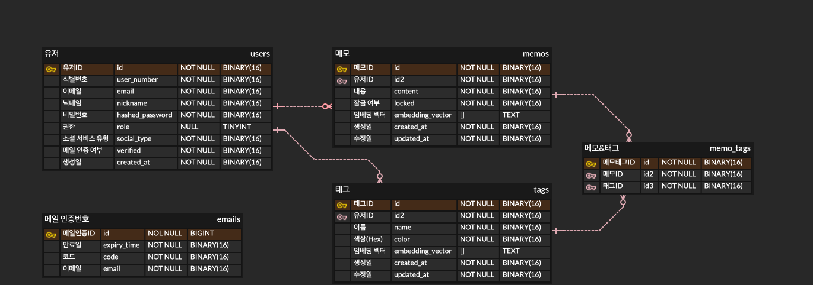

# 22-5-team2-server

<!-- logo -->

### Memo with tags Server

 

# 📝 MemoWithTags

---
# About our Project

**MemoWithTags**는 기존의 디렉터리 기반 메모 관리 방식을 탈피하여, **태그 기반의 유연한 메모 관리**와 **AI 기반 태그 추천** 기능을 통해 사용자가 더욱 효율적으로 정보를 분류하고 검색할 수 있도록 도와주는 혁신적인 메모 앱입니다.

## ✨ 주요 특징

- **태그 기반 메모 관리**  
  기존의 폴더나 디렉터리 방식과 달리, 메모마다 자유롭게 태그를 부여할 수 있어 다양한 관점에서 메모를 분류하고 검색할 수 있습니다.

- **AI 자동 태그 추천**  
  메모 작성 시 AI가 핵심 내용을 분석하여 적절한 태그를 자동으로 추천해줍니다. 덕분에 사용자는 더욱 빠르게 메모를 정리하고, 중요한 정보를 놓치지 않을 수 있습니다.

- **직관적 인터페이스**  
  사용자 경험을 극대화한 디자인과 간편한 인터페이스를 제공하여 복잡한 분류 체계 없이도 원하는 메모를 즉시 찾을 수 있습니다.

- **효율적인 검색 기능**  
  태그 기반 검색과 키워드 필터링 기능을 통해 수많은 메모 속에서도 원하는 정보를 빠르게 조회할 수 있습니다.

-  **태그 관리의 개인화**  
  개인의 업무 스타일에 맞게 태그를 커스터마이징하고, 메모를 자유롭게 연결할 수 있어 창의적인 아이디어 정리에 최적화되어 있습니다.

 

## 📱 화면 구성
</td>
</td>
</td>

---
# 💪 우리 조의 강점

### 🚀 기획부터 완성까지  
치밀한 기획을 바탕으로 실제 서비스로 이용 가능할 정도의 높은 완성도의 앱을 개발하였습니다..

### 🤖 AI 접목으로 서비스 혁신  
단순 앱 개발을 넘어 AI 기술을 융합하여, 서비스의 질을 한층 더 향상시켰습니다.

### 🗂 효율적인 디렉터리 구조  
체계적인 디렉터리 설계를 통해, 향후 서비스 확장 시 **유지 보수 및 확장성이 뛰어나도록** 준비했습니다.

---
# 📌 주요 기능

MemoWithTags는 태그 기반 메모 관리와 AI 자동 태그 추천을 통해 효율적인 메모 정리를 지원하는 서비스입니다.  
아래는 제공되는 주요 기능과 API 엔드포인트입니다.

---

## 🔐 **인증 (Auth)**
- **회원가입** → `POST /auth/register`
- **이메일 인증** → `POST /auth/verify-email`
- **로그인** → `POST /auth/login`
- **비밀번호 재설정** → `POST /auth/reset-password`
- **비밀번호 변경** → `PUT /auth/password`
- **닉네임 수정** → `PUT /auth/nickname`
- **토큰 재발급** → `POST /auth/refresh-token`
- **사용자 정보 조회** → `GET /auth/me`
- **회원 탈퇴** → `DELETE /auth/withdrawal`

---

## 📝 **메모 (Memo)**
- **메모 생성** → `POST /memo`
- **메모 수정** → `PUT /memo/{memoId}`
- **메모 삭제** → `DELETE /memo/{memoId}`
- **메모 검색** → `GET /search-memo`
- **메모에 태그 추가** → `POST /memo/{memo-id}/tag`
- **메모에서 태그 삭제** → `DELETE /memo/{memo-id}/tag`

---

## 🏷 **태그 (Tag)**
- **전체 태그 가져오기** → `GET /tag`
- **태그 생성** → `POST /tag`
- **태그 수정** → `PUT /tag/{tagId}`
- **태그 삭제** → `DELETE /tag/{tagId}`

---

## 🔗 **소셜 로그인 (Social)**
- **카카오 로그인** → `GET /auth/login/kakao`
- **네이버 로그인** → `GET /oauth/naver`
- **구글 로그인** → `GET /oauth/google`

---

## ⚙️ **관리자 기능 (Admin)**
- **유저 목록 조회** → `GET /admin/user`
- **유저 계정 생성** → `POST /admin/user`

---

이 API 목록을 통해 MemoWithTags의 주요 기능을 한눈에 확인할 수 있습니다.  
더욱 직관적인 태그 기반 메모 관리와 AI 자동 태그 추천 기능을 통해 생산성을 높여보세요! 🚀

👉🏻 [API 바로보기](http://43.201.64.202:8080/swagger-ui/index.html#)

# 🧑‍💻 Development

## ⚙ 기술 스택
### Back-end

  
  
  
  
  
  
  
  
  
  

### AI

  
  

### Tools

  
  

## 🛢️ ERD

## 🤔 기술적 이슈와 해결 과정

- 메일 인증 시스템
  - STMP 서버를 통해 이메일 인증 기능을 구현하는 과정에서 암호화 프로토콜(SSL/TLS), 구글 보안 정책 등으로 인해 여러 어려움을 겪었습니다.
  - 아래의 웹 사이트를 참고하여 문제를 해결하였습니다.
  - https://dev-annals.tistory.com/68
  - https://docs.spring.io/spring-framework/reference/integration/email.html
  - https://chatgpt.com/
- 소셜 로그인
  - 카카오, 네이버, 구글 세 가지 서비스를 통해 로그인할 수 있도록 각각의 서비스에서 제공하는 API를 활용하였습니다.
  - Java의 라이브러리를 Kotlin에서 사용하며 발생한 오류와, API 요청과 응답으로 쓰이는 JSON 파싱 중 발생한 오류 등을 해결하기 위해, ChatGPT와 Perplexity를 사용하였습니다.
- 내용이 긴 매모
  - 내용이 긴 메모를 보낼 때, MySQL에서 정해진 content 필드의 크기 한계로 인해 오류가 발생하여 500 에러가 발생하였습니다.
  - JPA Entity를 정의할 때 @Lob, @Column의 columnDefinition 지정 등으로 content 필드를 TEXT 타입으로 지정하여 해결하였습니다. 

# 💁‍♂️ 프로젝트 팀원
<table style="width:100%; table-layout: fixed; text-align: center;">
  <tr>
    <th>iOS + PM</th>
    <th>iOS</th>
    <th>Design</th>
    <th>Backend</th>
    <th>Backend</th>
    <th>Backend</th>
  </tr>
  <tr>
    <td></td>
    <td></td>
    <td></td>
    <td></td>
    <td></td>
    <td></td>
  </tr>
  <tr>
    <td><a href="https://github.com/Swimming-in-Seoul">류수영</a></td>
    <td><a href="https://github.com/jinmo0320">최진모</a></td>
    <td>한수정</td>
    <td><a href="https://github.com/Criminal0627">김용범</a></td>
    <td><a href="https://github.com/kih00">김인호</a></td>
    <td><a href="https://github.com/Leafguyk">이종호</a></td>
  </tr>
</table>
