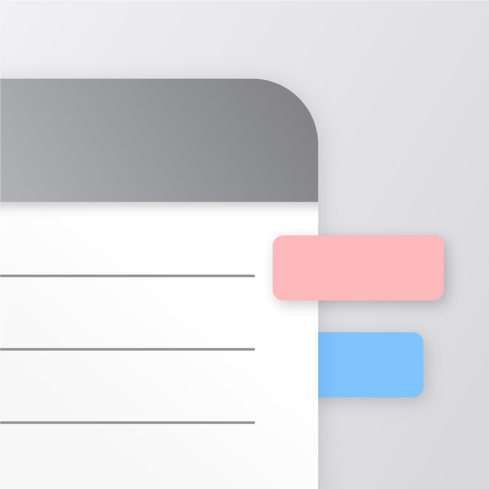

# 22-5-team2-server

<!-- logo -->

### Memo with tags Server

  
  

 

## 📝MemoWithTags
# MemoWithTags

**MemoWithTags**는 기존의 디렉터리 기반 메모 관리 방식을 탈피하여, **태그 기반의 유연한 메모 관리**와 **AI 기반 태그 추천** 기능을 통해 사용자가 더욱 효율적으로 정보를 분류하고 검색할 수 있도록 도와주는 혁신적인 메모 앱입니다.

---

## 주요 특징

 **태그 기반 메모 관리**  
  기존의 폴더나 디렉터리 방식과 달리, 메모마다 자유롭게 태그를 부여할 수 있어 다양한 관점에서 메모를 분류하고 검색할 수 있습니다.

**AI 자동 태그 추천**  
  메모 작성 시 AI가 핵심 내용을 분석하여 적절한 태그를 자동으로 추천해줍니다. 덕분에 사용자는 더욱 빠르게 메모를 정리하고, 중요한 정보를 놓치지 않을 수 있습니다.

**직관적 인터페이스**  
  사용자 경험을 극대화한 디자인과 간편한 인터페이스를 제공하여 복잡한 분류 체계 없이도 원하는 메모를 즉시 찾을 수 있습니다.

**효율적인 검색 기능**  
  태그 기반 검색과 키워드 필터링 기능을 통해 수많은 메모 속에서도 원하는 정보를 빠르게 조회할 수 있습니다.

 **맞춤형 워크플로우 지원**  
  개인의 업무 스타일에 맞게 태그를 커스터마이징하고, 메모를 자유롭게 연결할 수 있어 창의적인 아이디어 정리에 최적화되어 있습니다.

 

### 화면 구성
|Screen #1|Screen #2|
|:---:|:---:|
|||

 

## 우리 조의 자랑할 거리

# 📌 주요 기능

MemoWithTags는 태그 기반 메모 관리와 AI 자동 태그 추천을 통해 효율적인 메모 정리를 지원하는 서비스입니다.  
아래는 제공되는 주요 기능과 API 엔드포인트입니다.

---

## 🔐 **인증 (Auth)**
- **회원가입** → `POST /auth/register`
- **이메일 인증** → `POST /auth/verify-email`
- **로그인** → `POST /auth/login`
- **비밀번호 재설정** → `POST /auth/reset-password`
- **비밀번호 변경** → `PUT /auth/password`
- **닉네임 수정** → `PUT /auth/nickname`
- **토큰 재발급** → `POST /auth/refresh-token`
- **사용자 정보 조회** → `GET /auth/me`
- **회원 탈퇴** → `DELETE /auth/withdrawal`

---

## 📝 **메모 (Memo)**
- **메모 생성** → `POST /memo`
- **메모 수정** → `PUT /memo/{memoId}`
- **메모 삭제** → `DELETE /memo/{memoId}`
- **메모 검색** → `GET /search-memo`
- **메모에 태그 추가** → `POST /memo/{memo-id}/tag`
- **메모에서 태그 삭제** → `DELETE /memo/{memo-id}/tag`

---

## 🏷 **태그 (Tag)**
- **전체 태그 가져오기** → `GET /tag`
- **태그 생성** → `POST /tag`
- **태그 수정** → `PUT /tag/{tagId}`
- **태그 삭제** → `DELETE /tag/{tagId}`

---

## 🔗 **소셜 로그인 (Social)**
- **카카오 로그인** → `GET /auth/login/kakao`
- **네이버 로그인** → `GET /oauth/naver`
- **구글 로그인** → `GET /oauth/google`

---

## ⚙️ **관리자 기능 (Admin)**
- **유저 목록 조회** → `GET /admin/user`
- **유저 계정 생성** → `POST /admin/user`

---

이 API 목록을 통해 MemoWithTags의 주요 기능을 한눈에 확인할 수 있습니다.  
더욱 직관적인 태그 기반 메모 관리와 AI 자동 태그 추천 기능을 통해 생산성을 높여보세요! 🚀

👉🏻 [API 바로보기](/backend/APIs.md)

 

## ⚙ 기술 스택
### Back-end

  
  
  
  

### Infra

  

### Tools

  
  

 

## 🛠️ 프로젝트 아키텍쳐

 

## 🤔 기술적 이슈와 해결 과정
- 소셜로그인 

 

## 개발 정보
### 개발 로드맵
- 추가 예정
### Git 컨벤션
- 추가 예정
### 💁‍♂️ 프로젝트 팀원
|                       AI 개발                       |                  User 개발                   |                 Memo & Tag 개발                 |
|:-------------------------------------------------:|:------------------------------------------:|:---------------------------------------------:|
|  |  |  |
|      [김용범](https://github.com/Criminal0627)       |      [김인호](https://github.com/kih00)       |      [이종호](https://github.com/Leafguyk)       |
